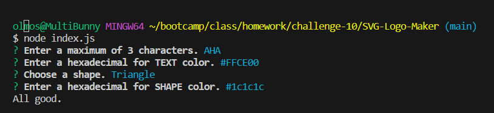

# SVG LOGO MAKER

## Description
This project is run by Javascript, ExpressJS, and Node. The intentions for this project is to create a very simply svg file, to be used for a logo.

## Installation
No steps for installation.

## Usage
This project is only run by the terminal and using the node command. Running "node index.js" will bring up question in regards to what the simple logo will contain. First, it will ask what text will be used. Up to 3 characters are allowed. Then, it will bring up text color, which will only accept a hexadecimal format, ex: #123ABC. Then it will ask the user for their choice of a shape. Lastly, it will prompt the user the color for the shape. Again, it will only accept a hexadecimal format. Once the user correctly answers each question, a "logo.svg" file will generate, containing the shape and it's color, and text and it's color, from which the user answered.

## Walkthrough Video

https://drive.google.com/file/d/1cg12l9PkblnJwQktNjXOqaRn4ReCVDu7/view?usp=drive_link